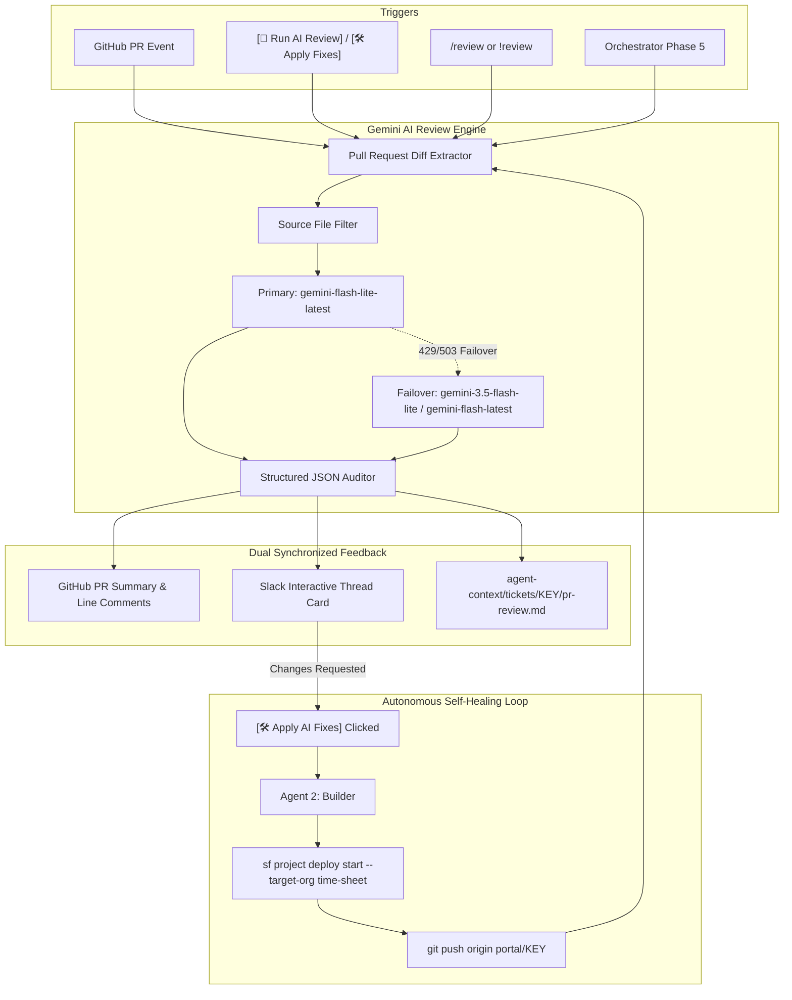

# 🤖 Gemini AI PR Code Review & Autonomous Self-Healing Pipeline
## Complete Implementation Specification & System Documentation

**Repository**: `nandini-teqfocus/poc-loop-engineering`  
**Target Salesforce Org**: `time-sheet` (`nandini.singh.c2d90108260b@agentforce.com`)  
**Mandatory Identity**: `nandini-teqfocus` GitHub Account  
**Primary AI Engine**: Google Gen AI SDK (`@google/genai`) — `gemini-flash-lite-latest` (with multi-model failover)

---

## 📑 Table of Contents
1. [System Architecture](#1-system-architecture)
2. [Implemented Core Components](#2-implemented-core-components)
3. [Interactive Slack Experience](#3-interactive-slack-experience)
4. [Autonomous Self-Healing Loop ("Apply AI Fixes")](#4-autonomous-self-healing-loop-apply-ai-fixes)
5. [GitHub Actions CI/CD Integration](#5-github-actions-cicd-integration)
6. [Resilience, Quota & Multi-Model Failover](#6-resilience-quota--multi-model-failover)
7. [Verification Suites & Test Runners](#7-verification-suites--test-runners)
8. [Developer Quick-Reference Cheatsheet](#8-developer-quick-reference-cheatsheet)

---

## 1. System Architecture

The following diagram illustrates how the Gemini AI Reviewer and Auto-Fix capabilities fit into the autonomous multi-agent software delivery pipeline:



---

## 2. Implemented Core Components

### A. Core AI Review Engine (`src/aiCodeReviewer.js`)
- **Strict Code-Only Scope**: Explicitly instructed to review **only code and file changes in the diff**. Ignores ticket requirements, business criteria, and external artifacts.
- **Structured JSON Schema**:
  - `verdict`: `'APPROVED' | 'CHANGES_REQUESTED' | 'COMMENT'`
  - `overallScore`: Integer `0 - 10`
  - `summary`: High-level code quality summary
  - `highlights`: Array of strengths
  - `securityAdvisories`: Array of `{ severity, title, description, cweOrOwasp }`
  - `inlineComments`: Array of `{ filePath, line, category, severity, comment, suggestedFix }`
- **Salesforce & General Rules Enforced**:
  - Apex Governor Limits (no SOQL / DML inside loops)
  - Security controls (no hardcoded secrets, `with sharing` enforcement, CRUD/FLS)
  - Null-safety, bulkification, and XML schema standards

### B. GitHub PR Client (`src/githubPrClient.js`)
- **Intelligent Diff Filtering**: Excludes binary assets, docs, and lockfiles (`package-lock.json`) so the review focuses exclusively on source files.
- **Line & Hunk Mapper**: Accurately maps unified diff line numbers to GitHub review comments.
- **Author Self-Review Fallback**: Automatically intercepts GitHub's limitation where a bot or user token cannot formally approve its own PR, smoothly downgrading to an approval comment without breaking execution.

### C. Main Pipeline Integration (`orchestrator.js`)
- Directly wired into **Phase 5 (`runPrReviewWorkflow`)** of the end-to-end loop.
- When any Jira ticket is executed, the orchestrator triggers the Gemini review, writes the audit file to `agent-context/tickets/<KEY>/pr-review.md`, and gates ticket advancement until approved.

---

## 3. Interactive Slack Experience

### A. Dynamic Buttons on PR Cards
Whenever a Pull Request is announced in Slack, interactive buttons are attached:
- **`[ 🎯 JIRA Ticket ]`**: Direct link to the Atlassian Jira issue.
- **`[ 🐙 GitHub PR ]`**: Direct link to the GitHub Pull Request.
- **`[ 🤖 Run AI Review ]`**: One-click review execution.
- **`[ 🛠️ Apply AI Fixes ]`**: Displayed automatically whenever issues or recommendations exist.

### B. Slack Slash Commands (`/review` & `/code-review`)
- **Direct invocation**:
  ```text
  /review 7
  /code-review SCRUM-13
  /review https://github.com/nandini-teqfocus/poc-loop-engineering/pull/7
  ```
- **Helper / Discovery**: Typing `/review` or `/review help` lists all currently open PRs with branches and usage examples.
- **Channel Message Fallback**: Users can type `!review 7` or `/review 7` as regular channel messages if slash commands are not yet bound in Slack App settings.

### C. Natural Language Thread Commands
Team members can reply in any active ticket thread:
- `review PR 7`
- `ai review`
- `run code review`
- `apply fixes`
- `fix issues`

---

## 4. Autonomous Self-Healing Loop ("Apply AI Fixes")

When code issues or vulnerabilities are found, developers can click **`[ 🛠️ Apply AI Fixes ]`** or reply `apply fixes`:

1. **Gathers Review Recommendations**: Reads Gemini's line-by-line recommendations and security advisories from `agent-context/tickets/<KEY>/pr-review.md`.
2. **Spawns Builder (Agent 2)**: Feeds the suggested fixes directly into `buildAgent2PrReviewFixPrompt`.
3. **Salesforce Deployment Validation**: Agent 2 applies the fixes and validates deployment to the `time-sheet` org via:
   ```bash
   sf project deploy start --target-org time-sheet
   ```
4. **Git Commit & Push**: Commits changes directly to the feature branch (`portal/<TICKET-KEY>`) and pushes to GitHub.
5. **Automated Re-Review**: Automatically runs a fresh Gemini code review to confirm that the code now passes with an updated score!

---

## 5. GitHub Actions CI/CD Integration

### Workflow Configuration (`.github/workflows/pr-code-review.yml`)
- **Triggers**: Runs automatically on `pull_request` events (`opened`, `synchronize`, `reopened`, `ready_for_review`) and `workflow_dispatch`.
- **Concurrency Control**: Automatically cancels obsolete in-progress runs when new commits are pushed.
- **Job Summary**: Renders formatted Markdown tables and highlights in the GitHub Actions Step Summary.
- **Switchable Execution**: Controlled via the central switch (`switchManager.js` / `scripts/toggle-switch.js`) to choose between Cloud CI/CD or Local Agent execution.

---

## 6. Resilience, Quota & Multi-Model Failover

| Mechanism | Implementation |
|---|---|
| **Primary Production Model** | `gemini-flash-lite-latest` (1,500 requests/day free tier quota, ~1.8s latency) |
| **Failover Models** | `gemini-3.5-flash-lite` $\rightarrow$ `gemini-flash-latest` |
| **Quota Spike Handling (429)** | Instantly detects quota exhaustion and switches models without delay |
| **Server Demand Spikes (503)** | Exponential backoff retry (1.5s, 3.0s) per model before switching |
| **JSON Recovery** | Strips markdown fences (````json`) and sanitizes malformed responses |

---

## 7. Verification Suites & Test Runners

The repository includes standalone scripts to test and verify every capability locally:

| NPM Script | Command | Purpose |
|---|---|---|
| `npm run test:ai-review` | `node scripts/test-ai-review.js` | Runs diagnostic audit against vulnerable Apex code (CWE-798, governor limits) |
| `npm run test:slack-review` | `node scripts/test-slack-live-review.js` | Posts live PR announcement and review card to Slack |
| `npm run test:auto-fix` | `node scripts/test-auto-fix.js` | Tests the interactive `[ 🛠️ Apply AI Fixes ]` button in Slack |
| `npm run test:connections` | `node scripts/test-connections.js` | Validates Jira, Slack, Salesforce, and Gemini connections |
| `CLI PR Review` | `node scripts/run-ai-code-review.js --pr 7` | Runs standalone Gemini code review for any PR number |
| `Switch Toggle` | `node scripts/toggle-switch.js --local` | Toggles between GitHub Actions mode and Local Agent mode |

---

## 8. Developer Quick-Reference Cheatsheet

### Starting the Orchestrator
```bash
npm start
```

### Running a Review from the Command Line
```bash
node scripts/run-ai-code-review.js --pr <PR_NUMBER>
```

### Reviewing via Slack
- Click **`[ 🤖 Run AI Review ]`** on any PR announcement card.
- In any thread, type: `review PR <NUMBER>`
- In any channel, type: `/review <NUMBER>` or `!review <NUMBER>`

### Applying AI Fixes via Slack
- Click **`[ 🛠️ Apply AI Fixes ]`** on any changes-requested card.
- In the thread, type: `apply fixes` or `fix issues`

---
*Generated by Antigravity AI Assistant for the `poc-loop-engineering` project.*
