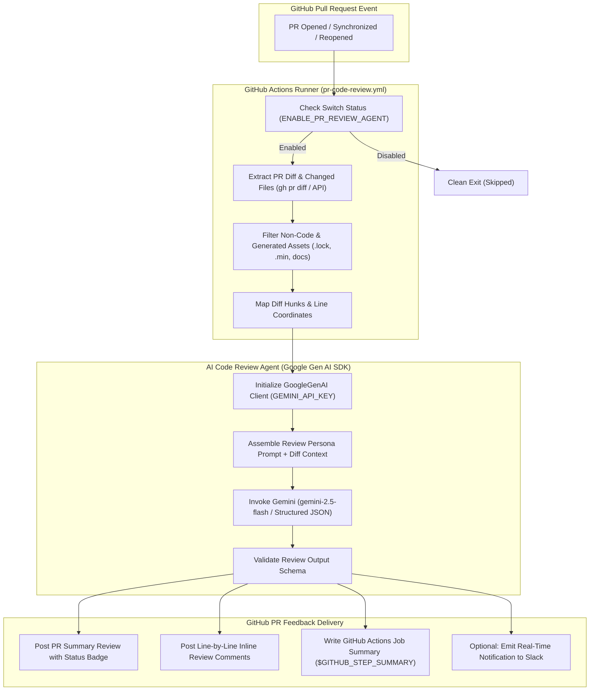

# 🛠️ Implementation Plan: AI PR Code Review Agent

**Project:** POC Loop Engineering  
**Target Repository:** `https://github.com/nandini-teqfocus/poc-loop-engineering`  
**Target Environment:** GitHub Actions CI/CD  
**Engine:** Gemini API (`@google/genai` / Google Agent Development Kit)  
**Document Version:** 1.0.0  
**Status:** DRAFT / PROPOSED (Do Not Implement Yet)  

---

## 1. Executive Overview & Scope

### 1.1 Objective
Establish an automated **AI PR Code Review Agent** that runs inside **GitHub Actions** on pull request events, powered by the **Gemini API** via the **Google Gen AI SDK / Google Agent SDK**.

The agent inspects **ONLY the code and files modified within the Pull Request**, performing a deep, specialized engineering review focused purely on:
- **Code Quality & Readability**
- **Defects, Edge Cases & Logic Bugs**
- **Security Vulnerabilities & Secrets Leakage**
- **Performance, Scalability & Resource Efficiency**
- **Maintainability, Modularity & Design Best Practices**

### 1.2 Strict Non-Goals & Boundaries
To keep the review actionable, objective, and decoupled from external project tracking:
- ❌ **NO Jira Ticket Verification:** The agent will **NOT** query Jira, inspect user stories, or check acceptance criteria.
- ❌ **NO Business Logic Validation:** The agent will **NOT** evaluate whether the PR meets business requirements or feature scope.
- ❌ **NO Architecture Feasibility Auditing:** The agent will **NOT** evaluate high-level roadmap decisions or ticket architecture.
- ❌ **NO Unrelated File Scanning:** The agent will **ONLY** review files and lines touched in the PR diff, ignoring untouched codebase files.

### 1.3 Preservation of Existing Functionality
The existing project contains an autonomous multi-agent delivery loop (`orchestrator.js`), persistent living memory (`agent-context/`), and a dual-engine PR review switch (`src/switchManager.js`). 
- The new AI Code Review Agent will integrate cleanly with the existing GitHub Actions architecture without breaking the local orchestrator, JIRA sync, or Salesforce deployment pipeline.
- The dual-engine switch will control whether the GitHub Actions AI code review runs, preserving team control.

---

## 2. Architecture & Workflow Design



### 2.1 Workflow Sequence
1. **PR Event Trigger:** Developer or autonomous agent (`portal/<KEY>`) opens or updates a Pull Request targeting `main`.
2. **Switch Check:** The workflow checks `ENABLE_PR_REVIEW_AGENT`. If set to `false`, the review is bypassed cleanly.
3. **Diff Extraction:** The runner queries the GitHub API or GitHub CLI (`gh pr diff`) to retrieve the exact unified diff and list of modified files.
4. **File Filtering:** Configuration filters out binary files, lockfiles (`package-lock.json`), build artifacts, and non-code assets.
5. **AI Agent Invocation:**
   - The diff is packaged with strict instructions into the Gemini model via `@google/genai`.
   - The model generates structured review findings adhering to a typed JSON schema (Summary, Verdict, Security Findings, Line-specific Comments).
6. **Publishing Findings:**
   - A top-level PR review summary is posted with an overall quality verdict.
   - For high-confidence issues with specific line coordinates, inline review comments are submitted directly on the PR diff.
   - A formatted markdown summary is appended to `$GITHUB_STEP_SUMMARY`.

---

## 3. Google Agent SDK & Gemini Integration

### 3.1 Recommended SDK: `@google/genai` (Google Gen AI SDK)
Google's modern, unified generative AI library for Node.js/TypeScript is `@google/genai`. It replaces `@google/generative-ai` and provides:
- First-class support for Gemini 2.5 and 1.5 models.
- Native Structured Outputs (`responseMimeType: 'application/json'` with `responseSchema`).
- Built-in retry handling and streaming capabilities.

*(Note: If multi-turn agent tool calling is required in the future, the Google Agent Development Kit `@google/adk` can be layered on top).*

### 3.2 Model Selection
- **Default / Recommended:** `gemini-2.5-flash`
  - **Rationale:** Ultra-fast latency (< 4 seconds for full PR diffs), massive 1M+ token context window (easily fits large diffs), superior code reasoning, and highly cost-effective.
- **Alternative / Deep Audit:** `gemini-2.5-pro`
  - **Rationale:** Configurable via repository variable `GEMINI_MODEL=gemini-2.5-pro` for mission-critical repositories or complex refactors requiring deeper chain-of-thought analysis.

### 3.3 Structured JSON Schema Definition
The Gemini model will be constrained to output a strict JSON schema:

```typescript
interface CodeReviewResult {
  verdict: 'APPROVED' | 'CHANGES_REQUESTED' | 'COMMENT';
  overallScore: number; // 1 to 10
  summary: string; // Markdown summary of overall quality
  highlights: string[]; // Positive observations / clean code
  securityAdvisories: Array<{
    severity: 'CRITICAL' | 'HIGH' | 'MEDIUM' | 'LOW';
    title: string;
    description: string;
    cweOrOwasp?: string;
  }>;
  inlineComments: Array<{
    filePath: string;
    line: number; // Line number in the new file
    category: 'BUG' | 'SECURITY' | 'PERFORMANCE' | 'MAINTAINABILITY' | 'STYLE';
    severity: 'BLOCKER' | 'WARNING' | 'SUGGESTION';
    comment: string;
    suggestedFix?: string; // Optional code replacement snippet
  }>;
}
```

---

## 4. GitHub Actions Workflow & Trigger Configuration

### 4.1 Workflow File: `.github/workflows/pr-code-review.yml`
```yaml
name: AI PR Code Reviewer

on:
  pull_request:
    types: [opened, synchronize, reopened, ready_for_review]
  workflow_dispatch:
    inputs:
      model:
        description: 'Gemini Model'
        required: false
        default: 'gemini-2.5-flash'

concurrency:
  group: pr-code-review-${{ github.event.pull_request.number || github.ref }}
  cancel-in-progress: true

permissions:
  contents: read
  pull-requests: write
  issues: write

jobs:
  code-review:
    name: Gemini AI Code Review
    runs-on: ubuntu-latest
    if: github.event.pull_request.draft == false

    steps:
      - name: Checkout Repository
        uses: actions/checkout@v4
        with:
          fetch-depth: 0

      - name: Setup Node.js
        uses: actions/setup-node@v4
        with:
          node-version: 20
          cache: 'npm'

      - name: Install Dependencies
        run: npm ci || npm install

      - name: Execute AI Code Review
        env:
          GITHUB_TOKEN: ${{ secrets.GITHUB_TOKEN }}
          GH_TOKEN: ${{ secrets.GITHUB_TOKEN }}
          GEMINI_API_KEY: ${{ secrets.GEMINI_API_KEY }}
          GEMINI_MODEL: ${{ vars.GEMINI_MODEL || 'gemini-2.5-flash' }}
          ENABLE_PR_REVIEW_AGENT: ${{ vars.ENABLE_PR_REVIEW_AGENT || 'true' }}
          PR_NUMBER: ${{ github.event.pull_request.number }}
        run: |
          node scripts/run-ai-code-review.js --pr ${{ github.event.pull_request.number }}
```

---

## 5. Permissions & Secrets Configuration

### 5.1 GitHub Repository Secrets
| Secret Name | Required | Purpose |
|---|---|---|
| `GEMINI_API_KEY` | **Yes** | Google Gemini Developer API Key (generated from Google AI Studio). |
| `GITHUB_TOKEN` | Built-in | Default GitHub Actions token used for reading diffs and posting review comments. |

### 5.2 GitHub Workflow Permissions
```yaml
permissions:
  contents: read          # Access repository files and git history
  pull-requests: write    # Submit reviews, inline diff comments, and approvals
  issues: write           # Fallback for PR issue comments
```

### 5.3 Local Development Configuration (`.env`)
```bash
# Add to .env and .env.example
GEMINI_API_KEY=AIzaSy...
GEMINI_MODEL=gemini-2.5-flash
```

---

## 6. PR Diff Extraction & Filtering Engine

### 6.1 Extraction Mechanism
The runner will extract the PR diff using the GitHub CLI or GitHub REST API:
```bash
gh pr diff <PR_NUMBER> --patch
```
Or via Octokit/Fetch:
```http
GET /repos/{owner}/{repo}/pulls/{pull_number}/files
```

### 6.2 File Exclusion & Inclusion Rules
The agent reviews **only relevant source code files**:
- **Included Extensions:**
  - Salesforce: `.cls`, `.trigger`, `.page`, `.component`, `.js`, `.html`, `.css`, `.xml` (custom fields, rules, flows)
  - Backend/Scripts: `.js`, `.ts`, `.mjs`, `.json`, `.sh`, `.yml`, `.yaml`
- **Excluded Patterns:**
  - Lockfiles: `package-lock.json`, `yarn.lock`, `pnpm-lock.yaml`
  - Minified/Bundled: `*.min.js`, `*.min.css`, `dist/**`, `build/**`
  - Documentation: `*.md`, `LICENSE`, `docs/**`
  - Scratch/Logs: `*.log`, `scratch/**`, `.sf/**`, `.sfdx/**`

### 6.3 Diff Size Management
- If total diff exceeds 80,000 characters (~20,000 tokens), files will be chunked by module or grouped logically so each review batch receives adequate model attention without truncation.

---

## 7. Review Prompt & Agent Persona Design

### 7.1 System Prompt (Strict Code-Only Persona)
```markdown
You are a Principal Software Engineer, Senior Application Architect, and Application Security Auditor.
Your sole responsibility is to conduct an uncompromising, objective code review of the provided Pull Request diff.

STRICT OPERATIONAL DIRECTIVES:
1. REVIEW ONLY CHANGED LINES & ADJACENT CONTEXT:
   - Evaluate the code submitted in the git diff.
   - Do NOT review or invent requirements for unchanged external files.
2. ZERO JIRA / ZERO BUSINESS REQUIREMENT SCOPE:
   - You have NO knowledge of Jira tickets, stories, or acceptance criteria.
   - Do NOT attempt to guess what feature or ticket this code implements.
   - Do NOT evaluate whether the solution fulfills business goals or project tickets.
3. CONCENTRATE EXCLUSIVELY ON TECHNICAL EXCELLENCE:
   - Bugs & Logic Errors: Null pointers, unhandled edge cases, off-by-one errors, race conditions, type mismatches.
   - Security: Injection (SOQL/SQL/NoSQL), XSS, CSRF, insecure direct object references, hardcoded credentials or API keys, permission/CRUD/FLS violations in Salesforce.
   - Performance & Scalability: Governor limit violations (SOQL/DML inside loops), N+1 queries, unindexed filters, memory leaks, unoptimized loops.
   - Maintainability & Standards: Clean Code principles, naming conventions, proper error handling, idempotency, modular architecture.
4. TONE & STYLE:
   - Concise, direct, actionable, and constructive.
   - For every criticism, provide a concrete code fix or pattern recommendation.
   - If the code is clean, concise, and safe, state so clearly and approve.

OUTPUT FORMAT:
Return strictly a valid JSON object matching the requested schema. No markdown backticks around JSON unless requested.
```

### 7.2 User Prompt Construction
```markdown
Review the following Pull Request diff:

PR Title: {{ prTitle }}
PR Branch: {{ branchName }}

Changed Files & Diff Hunks:
```diff
{{ filteredDiff }}
```

Analyze the diff according to your instructions and output your findings in the required JSON format.
```

---

## 8. PR Commenting & Feedback Posting Mechanism

### 8.1 Dual-Tier PR Delivery Strategy

#### 1. Top-Level PR Review Summary (Overview)
Submitted as a GitHub PR Review comment containing:
- **Verdict Badge:** `✅ APPROVED` | `⚠️ CHANGES REQUESTED` | `💬 COMMENT`
- **Quality Score:** `Score: 9/10`
- **Executive Summary:** Bullet points summarizing code health.
- **Security Audit Box:** Clear warnings if security vulnerabilities are found.
- **Category Matrix Table:**
  | Category | Issues Found | Status |
  |---|---|---|
  | Security & Credentials | 0 | ✅ PASS |
  | Bugs & Edge Cases | 1 | ⚠️ WARNING |
  | Performance & Limits | 0 | ✅ PASS |
  | Maintainability | 0 | ✅ PASS |

#### 2. Line-by-Line Inline Diff Comments
For specific issues tied to line coordinates (e.g., SOQL inside a `for` loop at line 42), the agent uses the GitHub API:
```http
POST /repos/{owner}/{repo}/pulls/{pull_number}/comments
```
With format:
```markdown
> ⚠️ **[Performance - SOQL in Loop]**  
> SOQL query detected inside loop body. In Salesforce, this violates governor limits (maximum 100 SOQL queries per transaction).
>
> **Suggested Fix:**
> ```suggestion
> List<Contact> contacts = [SELECT Id, Name FROM Contact WHERE AccountId IN :accountIds];
> for (Contact c : contacts) {
>     // Process in memory
> }
> ```
```

### 8.2 Handling GitHub Self-Approval Restrictions
If the pull request author runs the action under their own `GITHUB_TOKEN`, GitHub returns:
`Can not approve your own pull request`.  
**Mitigation:** The runner detects this error and automatically downgrades the call to submit a regular review comment (`action: 'COMMENT'`) with full badges and findings, ensuring execution never fails.

---

## 9. Testing & Verification Strategy

### 9.1 Local Testing Suite
A standalone test script `scripts/test-ai-code-review.js` will allow local execution without opening PRs:
```bash
# Test with a local diff file or sample fixture
node scripts/test-ai-code-review.js --fixture test/fixtures/sample-diff-vulnerable.diff

# Test directly against an existing GitHub PR
GEMINI_API_KEY=AIza... node scripts/run-ai-code-review.js --pr 6 --dry-run
```

### 9.2 Test Fixtures to Validate
1. **Clean Diff Test:** Small PR with clean JS/Apex code. Expected: `APPROVED`, Score 9-10.
2. **Security Flaw Test:** PR containing a hardcoded API token or raw SOQL injection. Expected: `CHANGES_REQUESTED`, Critical Security Advisory.
3. **Performance Bug Test:** PR containing database queries inside a `for` loop. Expected: `CHANGES_REQUESTED`, Inline comment on loop line.
4. **Non-Code Diff Test:** PR modifying only `.md` or `.gitignore`. Expected: Skipped gracefully with clean message.

---

## 10. Files to Modify and Create

| File Path | Action | Description |
|---|---|---|
| `package.json` | **Modify** | Add `@google/genai` dependency and `"test:ai-review"` script. |
| `.env.example` | **Modify** | Document `GEMINI_API_KEY` and `GEMINI_MODEL` variables. |
| `.github/workflows/pr-code-review.yml` | **Create** | Dedicated GitHub Actions workflow triggered on pull request events. |
| `src/aiCodeReviewer.js` | **Create** | Core AI review engine: Gemini client, prompt assembler, JSON schema validator, diff filter. |
| `src/githubPrClient.js` | **Create** | GitHub API helper for fetching diffs, posting summary reviews, and creating inline line comments. |
| `scripts/run-ai-code-review.js` | **Create** | CLI and GitHub Actions runner script. |
| `scripts/test-ai-code-review.js` | **Create** | Test script to run the AI reviewer against local diff fixtures. |
| `test/fixtures/sample-diff-clean.diff` | **Create** | Test fixture for clean code. |
| `test/fixtures/sample-diff-buggy.diff` | **Create** | Test fixture with intentional security/performance bugs. |
| `README.md` | **Modify** | Add documentation section for the AI PR Code Review Agent. |

---

## 11. Implementation Roadmap & Step-by-Step Milestones

```
┌──────────────────────────────────────────────────────────────────────────────────┐
│                             IMPLEMENTATION MILESTONES                            │
├──────────────────────────────────────────────────────────────────────────────────┤
│ Milestone 1: Dependency Setup & Gemini Client Module                             │
│   • Install @google/genai in package.json                                        │
│   • Implement src/aiCodeReviewer.js with Gemini initialization & schema parser   │
│                                                                                  │
│ Milestone 2: Diff Extraction & File Filtering Engine                             │
│   • Implement src/githubPrClient.js to fetch diffs and parse patch hunks         │
│   • Implement exclusion filters for non-code assets                              │
│                                                                                  │
│ Milestone 3: Review Execution Runner & PR Commenting                             │
│   • Implement scripts/run-ai-code-review.js                                      │
│   • Support both summary reviews and inline diff comments                        │
│   • Implement GitHub author self-review fallback                                 │
│                                                                                  │
│ Milestone 4: GitHub Actions Workflow Configuration                               │
│   • Create .github/workflows/pr-code-review.yml                                  │
│   • Configure permissions, secrets, and Step Summaries                           │
│                                                                                  │
│ Milestone 5: Local Testing, Validation & Documentation                           │
│   • Run test fixtures verifying clean, buggy, and non-code PR diffs              │
│   • Update .env.example, README.md, and mark plan as complete                    │
└──────────────────────────────────────────────────────────────────────────────────┘
```

---

*Plan formulated for review and approval prior to implementation.*
