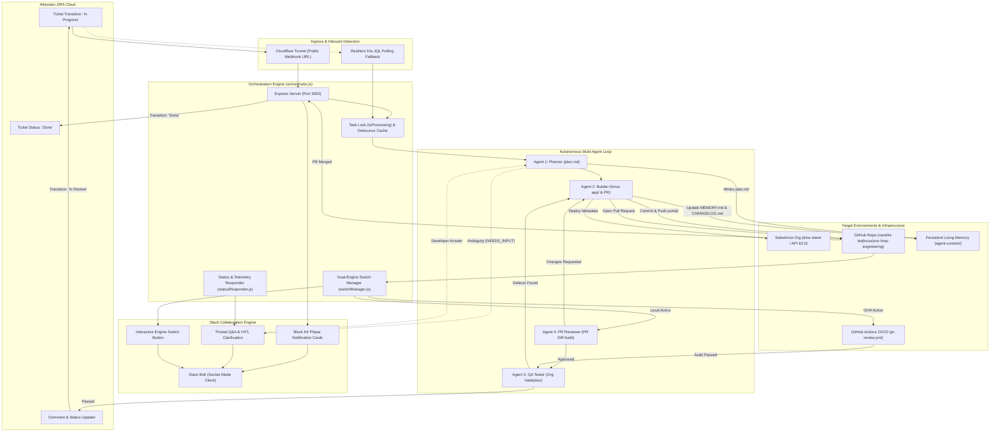

# 🔄 POC Loop Engineering — Comprehensive Project Analysis Report

**Project Name:** POC Loop Engineering (Autonomous Agentic Delivery Pipeline)  
**Target Repository:** `https://github.com/nandini-teqfocus/poc-loop-engineering`  
**Target Salesforce Org:** `time-sheet` (`nandini.singh.c2d90108260b@agentforce.com` / Org ID: `00DNS00000slNqE2AU`)  
**Mandatory GitHub Account:** `nandini-teqfocus`  
**Source API Version:** `62.0`  
**Generated Date:** 2026-09-16  
**Document Version:** 1.0.0 (Production Release)  

---

## Table of Contents

1. [Executive Summary & Project Objectives](#1-executive-summary--project-objectives)
2. [End-to-End System Architecture](#2-end-to-end-system-architecture)
3. [The Multi-Agent Ecosystem & Responsibilities](#3-the-multi-agent-ecosystem--responsibilities)
4. [Loop Engineering Execution Lifecycle](#4-loop-engineering-execution-lifecycle)
5. [Persistent Living Memory System](#5-persistent-living-memory-system)
6. [GitHub Actions & PR Review Agent](#6-github-actions--pr-review-agent)
7. [Agent ON/OFF Switch & Dual-Engine Control](#7-agent-onoff-switch--dual-engine-control)
8. [Atlassian JIRA Integration & Ticket Lifecycle](#8-atlassian-jira-integration--ticket-lifecycle)
9. [Salesforce Implementation & Org Architecture](#9-salesforce-implementation--org-architecture)
10. [Slack Integration, Notifications & Interactive Q&A](#10-slack-integration-notifications--interactive-qa)
11. [Current Implementation & Verification Status](#11-current-implementation--verification-status)
12. [Repository Inventory & Component Directory](#12-repository-inventory--component-directory)
13. [Completed Features vs. Pending Work](#13-completed-features-vs-pending-work)
14. [Technical Gaps, Edge Cases, Risks & Limitations](#14-technical-gaps-edge-cases-risks--limitations)
15. [Key Architectural Decisions & Evolution History](#15-key-architectural-decisions--evolution-history)
16. [Testing, Validation & Historical Verification](#16-testing-validation--historical-verification)
17. [Strategic Next Steps & Recommendations](#17-strategic-next-steps--recommendations)

---

## 1. Executive Summary & Project Objectives

### 1.1 Executive Overview
The **POC Loop Engineering** project establishes a closed-loop, autonomous multi-agent software engineering delivery pipeline designed specifically for incremental Salesforce development (targeting an Experience Cloud customer portal). 

Rather than treating Artificial Intelligence code generation as an isolated, single-prompt, human-supervised exercise, this platform implements a continuous, event-driven engineering cycle. The system monitors **Atlassian JIRA Cloud**, provisions isolated Git ticket branches, deploys headless **Google Antigravity (`agy`)** agents to perform architectural planning and Salesforce metadata development, deploys directly to target Salesforce sandbox orgs via the **Salesforce CLI (`sf`)**, enforces quality gates via automated **GitHub PR Reviews** and **QA defect cycles**, and automatically transitions tickets to **Done** when merged.

```
┌──────────────────────────────────────────────────────────────────────────────────┐
│                             THE CORE PROBLEM SOLVED                              │
├──────────────────────────────────────────────────────────────────────────────────┤
│ 1. Context Drift Across Sessions: Traditional AI assistants lose state across     │
│    separate prompts and cannot remember what was built in prior tickets.         │
│ 2. Unresolved Ambiguities: Ambiguous tickets cause LLMs to make incorrect         │
│    guesses, introducing bugs and requiring developer rollbacks.                  │
│ 3. Lack of Real Deployment Feedback: Generative tools generate code in a vacuum   │
│    without validating against actual Salesforce schema constraints or org rules. │
│ 4. Heavy Human Overhead: Developers must manually create branches, deploy XML,   │
│    open PRs, verify code quality, and update ticket statuses.                    │
└──────────────────────────────────────────────────────────────────────────────────┘
```

### 1.2 Strategic Objectives
- **Autonomous End-to-End Delivery:** Automate the complete software delivery cycle from `To Do` ➔ `In Progress` ➔ `In Review` ➔ `Done` with zero manual intervention required for standard user stories.
- **Git-Tracked Living Memory:** Maintain cumulative project state inside Git (`agent-context/`), ensuring that later tickets seamlessly build upon fields, validation rules, and components created in prior tickets.
- **Human-In-The-Loop (HITL) Clarification:** Enable agents to halt on ambiguous specifications, post structured questions into dedicated Slack threads, and resume deterministically upon receiving developer answers.
- **Automated Multi-Tier Quality Gates:** Provide automated gatekeeping via PR code review (Agent 4) and live org acceptance testing (Agent 3) with closed-loop bug-fixing cycles.
- **Resource Optimization (Dual-Engine Execution):** Implement an interactive switch allowing teams to toggle PR review execution between cloud CI/CD (GitHub Actions) to save local LLM tokens and local Agent 4 execution for rapid debugging.

---

## 2. End-to-End System Architecture

The architecture seamlessly connects cloud platforms (JIRA, GitHub, Slack) with a local Node.js orchestration engine, the Antigravity AI runtime, and target Salesforce infrastructure:



### 2.1 Architectural Flow Stages
1. **Trigger & Ingestion:** Moving an issue to `In Progress` fires a JIRA webhook through the Cloudflare Tunnel. A 10-second JQL polling engine acts as a resilient fallback against network or webhook interruptions.
2. **Context & Requirement Planning (Agent 1):** Agent 1 reads static instructions (`PROJECT.md`, `INSTRUCTIONS.md`) and living state (`MEMORY.md`), parses the JIRA description (ADF format), and formulates `agent-context/tickets/<KEY>/plan.md`. If ambiguous, it pauses and queries the team via Slack.
3. **Branch Setup & Build (Agent 2):** Orchestrator creates feature branch `portal/<KEY>`. Agent 2 generates SFDX metadata in `force-app/main/default/`, validates against `time-sheet` via `sf project deploy start`, updates living memory files, commits atomically, and opens a PR via `gh pr create`.
4. **Quality Gate 1 — PR Review (Dual-Engine):**
   - **GitHub Actions Mode (Active):** Cloud CI/CD workflow `.github/workflows/pr-review.yml` audits the PR diff on GitHub runners, saving local LLM tokens.
   - **Local Agent Mode:** Local Agent 4 audits PR diff, posts review comments, and triggers Builder Fix Mode if standards are violated.
5. **JIRA Finalization:** PR link is posted to JIRA; ticket moves to `In Review`.
6. **Quality Gate 2 — QA Validation (Agent 3):** Agent 3 verifies dry-run deployment and acceptance criteria against the live org. If issues arise, it cycles back to `In Progress` for Builder resolution.
7. **Merge Closure:** When the PR merges to `main`, GitHub webhooks notify the orchestrator, moving the JIRA ticket to `Done` and posting celebratory Slack cards.

---

## 3. The Multi-Agent Ecosystem & Responsibilities

The system divides software delivery across four specialized agent personas, each governed by strict system prompts (`src/prompts.js`):

| Agent Persona | Role Title | Core Responsibilities | Input Artifacts | Output Artifacts | Tool Group |
|---|---|---|---|---|---|
| **Agent 1** | **Planner** | Ingests project memory; analyzes ticket description; detects missing/ambiguous requirements; queries developer via Slack; formulates technical specifications. | `PROJECT.md`, `INSTRUCTIONS.md`, `MEMORY.md`, JIRA Summary & ADF Description | `agent-context/tickets/<KEY>/plan.md` | Read, JIRA MCP, Terminal |
| **Agent 2** | **Builder** | Reads `plan.md`; generates Salesforce XML metadata; executes live deployments; updates living memory; commits changes; opens GitHub PR; resolves PR and QA bugs in Fix Mode. | `plan.md`, `INSTRUCTIONS.md`, Target Org Connection, Review/QA Bug Reports | `force-app/...`, `MEMORY.md`, `CHANGELOG.md`, GitHub PR | Read, Write, Edit, `sf`, `gh`, `git` |
| **Agent 4** | **PR Reviewer** | Audits GitHub PR diff against acceptance criteria; verifies XML schema, `__c` suffixes, namespaces, and living memory updates; approves PR or requests fixes. | GitHub PR diff (`gh pr diff`), JIRA ticket acceptance criteria, `force-app/` metadata | GitHub PR Approval/Comment, `pr-review.md`, Slack Review Card | Read, `gh`, `git`, Slack |
| **Agent 3** | **QA Tester** | Validates org compilation via dry-run deployment; executes functional checks; audits schema against `plan.md`; drives iterative bug-fix loop until all criteria pass. | Target Org Schema (`sf sobject describe`), `plan.md`, `force-app/` metadata | `test-report.md`, JIRA stage transitions, Slack QA Cards | Read, `sf`, `git`, JIRA |

---

## 4. Loop Engineering Execution Lifecycle

The delivery loop progresses through seven deterministic execution phases managed by `orchestrator.js`:

```
┌──────────────────────────────────────────────────────────────────────────────────┐
│                         DETAILED PHASE EXECUTION LIFECYCLE                        │
├──────────────────────────────────────────────────────────────────────────────────┤
│ Phase 1: Ingestion & Initialization                                              │
│   • Fetch issue summary & parse ADF rich-text description from JIRA Cloud        │
│   • Transition issue to 'In Progress' if currently 'To Do'                       │
│   • Create ticket workspace: agent-context/tickets/<KEY>/                        │
│   • Announce start in Slack channel and register thread timestamp                │
│                                                                                  │
│ Phase 2: Planning & Requirement Analysis (Agent 1)                               │
│   • Read PROJECT.md, INSTRUCTIONS.md, MEMORY.md                                  │
│   • Check for ambiguities; emit NEEDS_INPUT: <question> if clarification needed  │
│   • Write complete technical plan to agent-context/tickets/<KEY>/plan.md         │
│                                                                                  │
│ Phase 3: Branch Setup & Environment Preparation                                  │
│   • Switch git context: git checkout -B portal/<KEY>                             │
│   • Verify target Salesforce org authentication (sf org display)                │
│                                                                                  │
│ Phase 4: Implementation & Salesforce Deployment (Agent 2)                        │
│   • Generate SFDX XML metadata under force-app/main/default/                     │
│   • Deploy to target org: sf project deploy start --target-org time-sheet        │
│   • Update agent-context/MEMORY.md and append entry to CHANGELOG.md              │
│   • Commit atomically: git commit -m "feat(<KEY>): <summary>"                    │
│   • Push branch and open PR via GitHub CLI: gh pr create                         │
│                                                                                  │
│ Phase 5: Automated PR Review (Dual-Engine Gatekeeper)                            │
│   • IF GitHub Actions Mode Active: Trigger GHA workflow; acknowledge in thread   │
│   • IF Local Mode Active: Spawn Agent 4; audit diff; loop on changes requested   │
│   • Submit approval badge or comment on GitHub PR                                │
│                                                                                  │
│ Phase 6: JIRA Finalization & Transition                                          │
│   • Post PR link and delivery summary comment to JIRA                            │
│   • Transition JIRA issue: 'In Progress' ➔ 'In Review'                           │
│                                                                                  │
│ Phase 7: QA Validation & Acceptance Testing (Agent 3)                            │
│   • Execute dry-run validation: sf project deploy start --dry-run                │
│   • Verify schema and acceptance criteria; generate test-report.md               │
│   • IF defects found: Transition to 'In Progress', invoke Builder Fix Mode, loop │
│   • IF passed: Post verification confirmation to Slack and JIRA                  │
│                                                                                  │
│ Phase 8: PR Merge & Final Closure (Webhook Automated)                            │
│   • Developer or team merges PR on GitHub into main                              │
│   • GitHub webhook detects action: 'closed' AND merged: true                     │
│   • Automatically transition linked JIRA ticket to 'Done'                        │
│   • Broadcast celebratory completion card with action buttons to Slack           │
└──────────────────────────────────────────────────────────────────────────────────┘
```

---

## 5. Persistent Living Memory System

### 5.1 The Living Memory Concept
Traditional agent implementations suffer from amnesia between invocations. This project establishes **Git-Tracked Living Memory** located under `agent-context/`:

```
agent-context/
├── PROJECT.md          # Static: Architecture, target org details, and coding standards
├── INSTRUCTIONS.md     # Static: Standing operational guidelines and agent protocols
├── MEMORY.md           # LIVING: Current inventory of deployed objects, fields, and automation
├── CHANGELOG.md        # Append-only: Historical ledger of completed tickets and PR links
├── switch-state.json   # Dynamic: Runtime state of the PR Review dual-engine switch
└── tickets/
    ├── SCRUM-1/        # Plan artifacts
    ├── SCRUM-6/        # plan.md (Blood Group, Allergies, Medical Contact)
    ├── SCRUM-8/        # plan.md (Insurance Provider, Coverage Status)
    ├── SCRUM-9/        # Contact fields
    └── SCRUM-10/       # pr-review.md (Service Tier, Onboarding Date)
```

### 5.2 Functional Separation: MEMORY.md vs. CHANGELOG.md
- **`MEMORY.md` (Curated Snapshot):** Answers *"What exists in the target org right now and why?"* Agent 1 reads this before writing a plan. It describes active fields, data types, validation formulas, and notes what is "Not yet done" (e.g., UI layout exposure).
- **`CHANGELOG.md` (Historical Ledger):** Answers *"What happened, in what order, and in which PR?"* Appended chronologically upon every ticket completion.
- **Atomic Commits:** Living memory updates are committed by Agent 2 on the feature branch together with code changes, ensuring documentation travels with the code and merges atomically.

---

## 6. GitHub Actions & PR Review Agent

To conserve local tokens, accelerate execution, and align with enterprise DevOps practices, the PR Review Agent can run directly in GitHub Actions CI/CD.

### 6.1 Workflow Architecture (`.github/workflows/pr-review.yml`)
- **Triggers:** Automatically executes on `pull_request` events (`opened`, `synchronize`, `reopened`, `ready_for_review`), as well as manual `workflow_dispatch`.
- **Concurrency Grouping:** Enforces `pr-review-${{ pr.number }}` with `cancel-in-progress: true` to prevent stale review jobs from wasting compute.
- **Headless Runner (`scripts/run-pr-review.js`):** Standalone Node.js script executing the core audit engine (`src/prReviewer.js`).

### 6.2 Audit Criteria Evaluated
1. **Salesforce Metadata Standards:** Verifies that metadata files are located under `force-app/main/default/`.
2. **Naming & API Conventions:** Ensures custom field filenames and XML tags include the mandatory `__c` suffix and match PascalCase conventions.
3. **XML Structure Validation:** Confirms valid XML declaration, proper Salesforce metadata namespace (`http://soap.sforce.com/2006/04/metadata`), and mandatory `<label>` and `<type>` tags.
4. **Living Memory Integrity:** Validates that `agent-context/CHANGELOG.md` and `agent-context/MEMORY.md` contain references to the current ticket key.
5. **GitHub Author Self-Approval Fallback:** When GitHub CLI rejects an author approving their own PR (`gh pr review --approve returned note: author cannot approve own PR`), the engine automatically falls back to submitting a formal review comment with approval/changes-requested badges.
6. **Artifact Generation:** Writes `agent-context/tickets/<KEY>/pr-review.md` and populates GitHub Actions Step Summaries (`$GITHUB_STEP_SUMMARY`).

---

## 7. Agent ON/OFF Switch & Dual-Engine Control

The pipeline features a dynamic, multi-channel controller allowing developers to switch between **GitHub Actions Mode** and **Local Agent Mode**:

```
+-----------------------------------------------------------------------------------+
|                        PR REVIEW DUAL-ENGINE SWITCH MATRIX                         |
+--------------------------+-----------------------+--------------------------------+
| Switch Mode              | GitHub Actions CI/CD  | Local Orchestrator (Phase 5)   |
+--------------------------+-----------------------+--------------------------------+
| 🚀 GitHub Actions Active | ENABLED (Runs on PR)  | Bypassed / Local Tokens Saved  |
| 💻 Local Agent Active    | DISABLED (gh disable) | ACTIVE (Agent 4 audits local)  |
+--------------------------+-----------------------+--------------------------------+
```

### 7.1 Multi-Interface Control Mechanisms
1. **Interactive Web Dashboard (`http://localhost:3000` or `/switch`):**
   - Cyberpunk dark-theme interface with a live glowing status indicator.
   - One-click toggle button calling `/api/switch/toggle`.
   - **"💬 Send Switch Button to Slack"** button to share the interactive controller with the engineering team.
2. **Interactive Slack Buttons:**
   - Block Kit action cards featuring `[ 💻 Switch to Local Agent ]` and `[ 🚀 Switch to GitHub Actions ]`.
   - Natural language trigger: Typing `switch`, `toggle`, or `pr mode` in Slack prompts the bot to drop the controller card into the channel.
3. **Terminal CLI Command:**
   ```bash
   node scripts/toggle-switch.js --on     # Enable GitHub Actions (Active)
   node scripts/toggle-switch.js --off    # Enable Local Agent (Active)
   node scripts/toggle-switch.js --status # Inspect current active mode
   ```

### 7.2 State Synchronization (`src/switchManager.js`)
When toggled, `switchManager.js`:
- Invokes GitHub CLI (`gh workflow enable pr-review.yml` or `gh workflow disable pr-review.yml`).
- Persists state to `agent-context/switch-state.json`.
- Aligns `process.env.ENABLE_PR_REVIEW_AGENT`.
- Emits real-time notification updates to Slack.

---

## 8. Atlassian JIRA Integration & Ticket Lifecycle

### 8.1 API Communication (`src/jira.js`)
- **Protocol:** Direct REST calls to Atlassian JIRA Cloud REST API v3 using HTTP Basic Authentication (`email:api_token`).
- **Atlassian Document Format (ADF) Parser:** `extractTextFromAdf()` recursively walks complex nested ADF document trees (paragraphs, bullet lists, ordered lists, tables, code blocks) to extract clean plain text for agent prompts.
- **Dynamic Transition Resolver:** Queries `/rest/api/3/issue/{key}/transitions` dynamically at runtime and matches target stages (`In Progress`, `In Review`, `Done`) case-insensitively, accommodating custom workflow transition IDs.

### 8.2 Event Ingestion & Webhook Handling
- **Express Webhook Endpoint (`/webhook/jira`):** Listens for JIRA transition and update events.
- **Transition Detection:** Evaluates `body.changelog.items` for `field: "status"` changes, falling back to `body.issue.fields.status.name`.
- **Resilient 10-Second Polling Fallback:** Periodically executes JQL searches (`project = SCRUM AND status = 'In Progress'`) to pick up new tickets automatically if Cloudflare tunnels or webhook deliveries experience network interruptions.

---

## 9. Salesforce Implementation & Org Architecture

### 9.1 Target Environment Specifications
- **Org Identifier:** `00DNS00000slNqE2AU`
- **Target Org Alias:** `time-sheet`
- **Target Org Username:** `nandini.singh.c2d90108260b@agentforce.com`
- **Source API Version:** `62.0`
- **Metadata Root:** `force-app/main/default/`

### 9.2 Live Deployed Metadata Inventory

#### 1. Account Object (`force-app/main/default/objects/Account/`)
- `Industry_Segment__c` (Picklist: A, B, C) — Categorization of accounts.
- `Renewal_Risk_Score__c` (Number: 3, 0) — Numerical risk rating (0-100).
- `Last_Health_Check__c` (Date) — Date of last customer review.
- `Primary_Competitor__c` (Text: 80) — Identified competitor account.
- `Contract_Value__c` (Currency: 18, 2) — Total value of customer agreement.
- `Auto_Renew__c` (Checkbox) — Automated contract extension flag.
- `Customer_Tier__c` (Picklist: Gold, Silver, Bronze) — SLA categorization.
- `Service_Tier__c` (Picklist: Standard, Premium, Enterprise) — Added in SCRUM-10.
- `Onboarding_Date__c` (Date) — Added in SCRUM-10.
- `Primary_Competitor_Required_High_Risk` (Validation Rule) — Enforces competitor entry when `Renewal_Risk_Score__c > 80`.

#### 2. Contact Object (`force-app/main/default/objects/Contact/`)
- `Blood_Group__c` (Picklist: A+, A-, B+, B-, O+, O-, AB+, AB-) — Health emergency tracking.
- `Allergies__c` (Long Text Area: 32768) — Medical allergies log.
- `Emergency_Contact_Name__c` (Text: 255) — Emergency contact person.
- `Emergency_Contact_Phone__c` (Phone) — Emergency contact direct dial.
- `Medical_Conditions__c` (Long Text Area: 32768) — Chronic medical notes.

#### 3. Opportunity Object (`force-app/main/default/objects/Opportunity/`)
- `Insurance_Provider__c` (Text: 255) — Associated insurance underwriter.
- `Coverage_Status__c` (Picklist: Active, Expired, Pending) — Coverage validation status.

---

## 10. Slack Integration, Notifications & Interactive Q&A

### 10.1 Socket Mode Integration (`src/slack.js`)
The orchestrator leverages Slack Bolt JS in **WebSocket Socket Mode** using an App-Level Token (`xapp-`). This eliminates the requirement for inbound public HTTP firewall ports for Slack events, enabling fully bidirectional real-time communication behind corporate firewalls.

### 10.2 Block Kit Notification Cards & Action Buttons
Every workflow milestone emits a formatted Slack card containing:
- Phase execution badges (`⏳ Started`, `✅ Completed`, `❌ Failed`).
- Detailed operational summary and next steps.
- **Dynamic Navigation Buttons:**
  - **`[ 🎯 JIRA Ticket ]`** — Direct link to the Atlassian Cloud ticket.
  - **`[ 🐙 GitHub PR ]`** — Direct link to the corresponding Pull Request.

### 10.3 Human-in-the-Loop Clarification Pattern
```
Agent 1 Outputs: "NEEDS_INPUT: <question>"
       │
       ▼
Orchestrator pauses agent & stores resolver Promise
       │
       ▼
Slack Bot posts question in ticket thread with @mention
       │
       ▼
Developer replies directly in Slack thread
       │
       ▼
Socket Mode listener catches reply & resolves Promise
       │
       ▼
Orchestrator resumes Agent 1: agy --continue "<reply>"
```

### 10.4 Intelligent Thread Status Q&A Responder (`src/statusResponder.js`)
When developers ask questions in Slack threads (e.g., *"why is this taking so long?"*, *"where are we?"*, *"show me the PR"*), the status responder classifies user intent and provides intelligent status telemetry:
- Tracks total execution elapsed time and active phase duration.
- Clarifies that Salesforce remote compilation and deployment typically require 1–3 minutes.
- Provides direct PR and JIRA links.

---

## 11. Current Implementation & Verification Status

| Workflow Step / Subsystem | Requirement Specification | Current Implementation Status | Verification Evidence & Notes |
|---|---|---|---|
| **JIRA Ingestion** | Ingest tickets transitioning to `In Progress` | **Operational & Verified** | Express webhook `/webhook/jira` + 10s JQL polling fallback. |
| **Concurrency Control** | Single-ticket execution lock | **Operational & Verified** | Global boolean `isProcessing` locks runs; rejects overlap. |
| **Context Ingestion** | Agent 1 reads static instructions & memory | **Operational & Verified** | Enforced in `prompts.js`. Verified across SCRUM-1 to SCRUM-10. |
| **HITL Ambiguity Resolution** | Pause on `NEEDS_INPUT` -> Slack Q&A -> Resume | **Operational & Verified** | Verified in SCRUM-6 (Blood Group picklist values). |
| **Plan Generation** | Structured `plan.md` in `agent-context/` | **Operational & Verified** | Verified plans generated for SCRUM-6, SCRUM-8, etc. |
| **Branch Management** | Feature branches `portal/<KEY>` from `main` | **Operational & Verified** | Automated git branch provisioning and tracking. |
| **Salesforce Metadata Build** | SFDX source format XML in `force-app/` | **Operational & Verified** | Validated across Account, Contact, and Opportunity objects. |
| **Org Deployment** | Deploy via `sf project deploy start` | **Operational & Verified** | Deployed and verified active in org `00DNS00000slNqE2AU`. |
| **Living Memory Maintenance** | Atomic updates to `MEMORY.md` & `CHANGELOG.md` | **Operational & Verified** | Tracked in Git history with code changes. |
| **GitHub PR Creation** | Automated PRs opened targeting `main` | **Operational & Verified** | PRs #1 through #6 opened using `nandini-teqfocus` account. |
| **Automated PR Review Gate** | Quality gate audit against criteria | **Operational & Verified** | Dual-engine support: Local Agent 4 + GitHub Actions. |
| **Dual-Engine Switch** | Toggle between GHA and Local Agent | **Operational & Verified** | Web dashboard, Slack buttons, and CLI toggle functional. |
| **QA Validation Loop** | Agent 3 org validation and bug repair | **Operational & Verified** | Iterative test execution report (`test-report.md`). |
| **PR Merge Finalization** | Webhook detects merge -> JIRA to `Done` | **Operational & Verified** | Verified on PR #3 (SCRUM-6) and PR #4 (SCRUM-8). |

---

## 12. Repository Inventory & Component Directory

```
poc-loop-engineering/
├── .github/
│   └── workflows/
│       └── pr-review.yml          # GitHub Actions workflow for PR Review Agent
├── agent-context/                 # Git-tracked Persistent Living Memory
│   ├── CHANGELOG.md               # Append-only chronological ticket ledger
│   ├── INSTRUCTIONS.md            # Standing operational protocols for agents
│   ├── MEMORY.md                  # Living inventory of deployed metadata
│   ├── PROJECT.md                 # Static architectural standards and org specs
│   ├── switch-state.json          # Persistent state of the PR review engine switch
│   └── tickets/                   # Ticket execution plans, reviews, and test reports
│       ├── SCRUM-1/               # Execution artifacts for Account fields
│       ├── SCRUM-6/               # Execution plan for Contact medical fields
│       ├── SCRUM-8/               # Execution plan for Opportunity fields
│       ├── SCRUM-9/               # Contact fields artifacts
│       └── SCRUM-10/              # Review reports for Service Tier & Onboarding
├── docs/                          # Comprehensive architectural and operational guides
│   ├── ARCHITECTURE_ANALYSIS.md   # Initial technical analysis report
│   ├── POC_HANDOFF.md             # Loop engineering architecture handoff guide
│   └── WORKFLOW_GUIDE.md          # Step-by-step workflow and sequence guide
├── force-app/main/default/        # Salesforce DX source directory
│   └── objects/
│       ├── Account/               # 8 custom fields + 1 validation rule
│       ├── Contact/               # 5 medical and emergency contact fields
│       └── Opportunity/           # 2 insurance and coverage status fields
├── scripts/                       # Automation, diagnostic, and execution scripts
│   ├── deliver-scrum6.js          # Standalone runner for SCRUM-6 verification
│   ├── run-pr-review.js           # CLI and CI/CD runner for PR Review Agent
│   ├── test-connections.js        # Integration diagnostic for JIRA & Slack
│   ├── test-slack-qa.js           # Automated test suite for status responder
│   └── toggle-switch.js           # CLI controller for the PR Review Switch
├── src/                           # Modular backend application logic
│   ├── agentRunner.js             # Antigravity CLI process wrapper & output parser
│   ├── jira.js                    # Atlassian JIRA REST API client & ADF parser
│   ├── prReviewer.js              # PR code audit engine & GitHub review handler
│   ├── prompts.js                 # Immutable prompt templates for Agents 1-4
│   ├── slack.js                   # Slack Bolt client, Block Kit cards & thread manager
│   ├── statusResponder.js         # Intelligent status responder & telemetry engine
│   └── switchManager.js           # Dual-engine state manager & GitHub sync
├── orchestrator.js                # Core Express application and pipeline coordinator
├── package.json                   # Project manifest, dependencies, and npm scripts
├── README.md                      # Production project documentation
└── sfdx-project.json              # Salesforce project definition (API v62.0)
```

---

## 13. Completed Features vs. Pending Work

### 13.1 Completed & Verified Capabilities
- [x] Full closed-loop automation from JIRA `To Do` to GitHub PR creation.
- [x] Bidirectional Slack Socket Mode integration with Block Kit notification cards.
- [x] Human-in-the-loop clarification pattern (`NEEDS_INPUT`) with automatic pause/resume.
- [x] Intelligent status responder answering developer inquiries in Slack threads.
- [x] Live Salesforce deployments using SFDX CLI against org `time-sheet`.
- [x] Multi-object metadata coverage across `Account`, `Contact`, and `Opportunity`.
- [x] Automated PR Review Agent (Agent 4) checking standards, naming, and memory.
- [x] GitHub Actions workflow `.github/workflows/pr-review.yml` for cloud CI/CD review.
- [x] Dual-engine switch with Web Dashboard, Slack button, and CLI controllers.
- [x] Automatic GitHub PR author self-approval workaround.
- [x] Automated PR merge detection transitioning JIRA issues to `Done`.
- [x] Resilient 10-second JQL polling fallback for JIRA ticket ingestion.

### 13.2 Pending Work & Roadmap Items
- [ ] **Branch Merge Reconciliation:** Merge open PRs (#1, #2, #5, #6) into `main` and consolidate `MEMORY.md` into a single unified state.
- [ ] **Experience Cloud UI Components:** Develop Lightning Web Components (LWCs) to surface custom backend fields on portal community pages.
- [ ] **Automated Apex Unit Testing:** Extend Agent 2 and Agent 3 to generate and execute Apex test classes with code coverage validation.
- [ ] **Persistent State Database:** Transition runtime thread and lock states from in-memory Maps to a lightweight SQLite database to survive server restarts.
- [ ] **Multi-Ticket Parallelization:** Implement a worker pool architecture to execute non-conflicting user stories concurrently.

---

## 14. Technical Gaps, Edge Cases, Risks & Limitations

### 14.1 Memory Divergence Across Git Branches (High Impact)
- **Root Cause:** When feature branches are created from `main` before previous PRs are merged, each branch contains only its own ticket's memory updates.
- **Current Manifestation:** `portal/SCRUM-6` contained Contact memory; `portal/SCRUM-8` contained Opportunity memory; `portal/SCRUM-1` contained Account memory. PR #3 and PR #4 are merged into `main`, but PR #1, #2, #5, and #6 remain open, leaving `MEMORY.md` on `main` partially fragmented.
- **Mitigation:** Rebase open branches onto `main` and merge them in sequence.

### 14.2 Sequential Execution Lock (Medium Impact)
- **Root Cause:** To prevent `agy --continue` session collision (since headless CLI invocations share the latest active conversation), `orchestrator.js` enforces a single sequential lock (`isProcessing`).
- **Limitation:** Only one ticket can be processed at any given moment. Simultaneous JIRA transitions must wait in queue.

### 14.3 Ephemeral In-Memory State (Medium Impact)
- **Root Cause:** Active Slack thread mappings (`ticketThreads`), status tracking (`ticketStateTracker`), and promise resolvers (`activeResolvers`) reside in RAM.
- **Risk:** If the orchestrator server crashes or restarts during execution, ongoing Slack clarification promises are lost, requiring manual ticket re-triggering.

### 14.4 Ephemeral Cloudflare Tunnel URLs (Low Impact)
- **Root Cause:** Quick tunnels (`cloudflared tunnel --url http://localhost:3000`) assign a new random URL upon every restart.
- **Mitigation:** The 10-second polling fallback in `orchestrator.js` ensures that ticket movement is detected even when the public webhook URL is stale.

---

## 15. Key Architectural Decisions & Evolution History

```
┌──────────────────────────────────────────────────────────────────────────────────┐
│                           KEY ARCHITECTURAL DECISIONS                            │
├──────────────────────────────────────────────────────────────────────────────────┤
│ 1. Git-Tracked Memory over External Vector Databases                             │
│    Decision: Store project memory in Markdown files inside the Git repo.         │
│    Rationale: Ensures documentation travels atomically with code PRs, is         │
│    human-readable/reviewable, and survives across different machines.            │
│                                                                                  │
│ 2. Slack Socket Mode over Public Ingress Endpoints                               │
│    Decision: Use Slack Bolt in Socket Mode (App Token).                          │
│    Rationale: Enables two-way Slack communication without opening inbound ports    │
│    or maintaining public DNS/firewall routes for Slack webhooks.                 │
│                                                                                  │
│ 3. Dual-Engine PR Review (Cloud CI/CD vs. Local Agent)                           │
│    Decision: Provide an interactive switch between GitHub Actions and Local.     │
│    Rationale: Saves expensive local LLM tokens during routine CI runs while      │
│    retaining local agent capability for offline debugging.                       │
│                                                                                  │
│ 4. Fallback Handling for GitHub Author Restrictions                              │
│    Decision: Fallback to review comments when author cannot approve own PR.      │
│    Rationale: Prevents pipeline failure caused by GitHub's security restriction  │
│    prohibiting a token from approving its own pull request.                      │
│                                                                                  │
│ 5. Resilient Polling Fallback alongside Webhook Ingress                          │
│    Decision: Add a 10s background JQL polling loop.                              │
│    Rationale: Guarantees zero missed tickets even during Cloudflare tunnel       │
│    dropouts or network latency spikes.                                           │
└──────────────────────────────────────────────────────────────────────────────────┘
```

---

## 16. Testing, Validation & Historical Verification

The platform has been validated through rigorous end-to-end executions across multiple live tickets:

```
                                    HISTORICAL EXECUTION TIMELINE
┌─────────────────────────────────────────────────────────────────────────────────────────────────────┐
│ SCRUM-1: Account Custom Fields & Validation Rule                                                    │
│ • Branch: portal/SCRUM-1 | PR: #1 (Open)                                                            │
│ • Delivered: Industry_Segment__c, Renewal_Risk_Score__c, Primary_Competitor__c, Validation Rule     │
│ • Verified: Successfully deployed to time-sheet org; living memory initialized.                     │
├─────────────────────────────────────────────────────────────────────────────────────────────────────┤
│ SCRUM-2: Customer Tier & Page Layout Exposure                                                       │
│ • Branch: portal/SCRUM-2 | PR: #2 (Open)                                                            │
│ • Delivered: Customer_Tier__c, Account Layout modification                                          │
│ • Memory Continuity: Agent 1 successfully read SCRUM-1 fields from MEMORY.md without re-querying.   │
├─────────────────────────────────────────────────────────────────────────────────────────────────────┤
│ SCRUM-6: Contact Medical & Emergency Contact Fields                                                 │
│ • Branch: portal/SCRUM-6 | PR: #3 (MERGED into main)                                                │
│ • Delivered: Blood_Group__c, Allergies__c, Emergency_Contact_Name__c, Medical_Conditions__c         │
│ • HITL Tested: Agent 1 paused on Blood Group picklist ambiguity; resumed via Slack user reply.      │
├─────────────────────────────────────────────────────────────────────────────────────────────────────┤
│ SCRUM-8: Opportunity Insurance Tracking Fields                                                      │
│ • Branch: portal/SCRUM-8 | PR: #4 (MERGED into main)                                                │
│ • Delivered: Insurance_Provider__c, Coverage_Status__c                                              │
│ • Verified: Autonomous execution from JIRA trigger to merge completion.                             │
├─────────────────────────────────────────────────────────────────────────────────────────────────────┤
│ SCRUM-10: Account Service Tier & Onboarding Date                                                    │
│ • Branch: portal/SCRUM-10 | PR: #6 (Open)                                                           │
│ • Delivered: Service_Tier__c, Onboarding_Date__c                                                     │
│ • Review Gate Verified: PR Review Agent audited diff, verified standards, and generated pr-review.md│
└─────────────────────────────────────────────────────────────────────────────────────────────────────┘
```

### 16.1 Automated Diagnostic Suites
- `scripts/test-connections.js`: Validates JIRA REST authentication, project access, and Slack Socket Mode connectivity.
- `scripts/test-slack-qa.js`: Tests the `statusResponder.js` natural language intent engine against 10 realistic developer prompts.
- `scripts/toggle-switch.js`: Verifies bidirectional synchronization between disk state, environment variables, and GitHub CLI workflow status.

---

## 17. Strategic Next Steps & Recommendations

### 17.1 Immediate Priorities (Next 24–48 Hours)
1. **Branch Consolidation on `main`:**
   - Review and merge open pull requests (PR #1, PR #2, PR #5, PR #6) into `main`.
   - Reconcile `agent-context/MEMORY.md` to produce a single, unified inventory of all Account, Contact, and Opportunity fields.
2. **Git Synchronization Hardening:**
   - Update `orchestrator.js` line 113 to ensure it always executes `git pull origin main` when preparing ticket context, preventing stale local branching.

### 17.2 Medium-Term Architectural Enhancements (1–2 Sprints)
1. **Persistent State Store (SQLite Integration):**
   - Migrate in-memory state objects (`ticketThreads`, `activeResolvers`, `ticketStateTracker`) to a persistent SQLite database (`agent-context/pipeline.db`).
   - Ensures runs can resume seamlessly even if the orchestrator server is rebooted.
2. **Experience Cloud LWC Layer:**
   - Introduce UI-focused tickets to build Lightning Web Components displaying the newly deployed medical, insurance, and account health fields on portal record pages.
3. **Automated Apex Generation & Test Coverage:**
   - Enhance Agent 2 system prompts to generate corresponding Apex controllers, service classes, and test classes with a mandatory 85%+ code coverage requirement verified during Phase 7.

### 17.3 Long-Term Scaling (Production Maturity)
1. **Multi-Tenant Worker Queue:** Replace the single-ticket `isProcessing` lock with a BullMQ / Redis distributed queue to allow parallel ticket execution across isolated containers.
2. **Named Cloudflare Tunnels:** Provision a permanent, named Cloudflare Tunnel with custom domain routing to eliminate ephemeral webhook URL rotation.

---

*Report compiled autonomously by Antigravity Agent for the Experience Cloud Portal project.*
