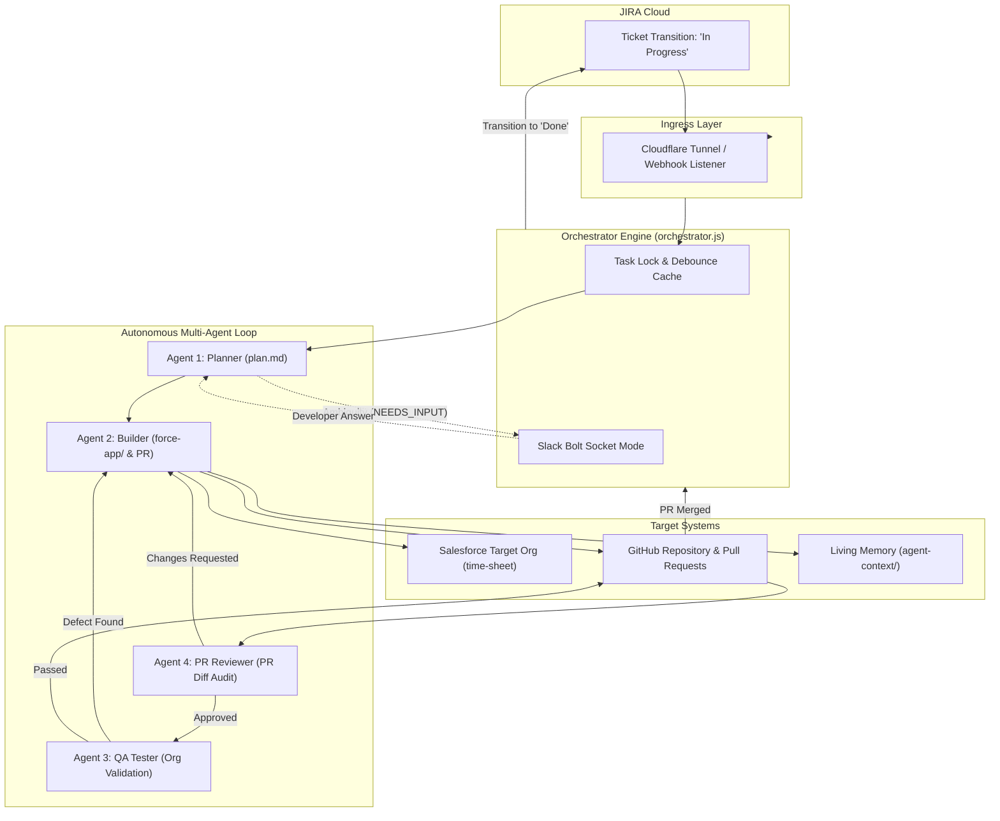

# 🔄 POC Loop Engineering

> **Autonomous Closed-Loop Multi-Agent Software Delivery Pipeline for Salesforce**

[](https://nodejs.org/)
[](https://developer.salesforce.com/tools/salesforcecli)
[](https://www.atlassian.com/software/jira)
[](https://slack.dev/bolt-js/)
[](LICENSE)

---

## 📖 Table of Contents

- [Overview](#-overview)
- [Key Features](#-key-features)
- [System Architecture](#-system-architecture)
- [The Multi-Agent Ecosystem](#-the-multi-agent-ecosystem)
- [Persistent Living Memory](#-persistent-living-memory)
- [Interactive Slack & JIRA Features](#-interactive-slack--jira-features)
- [Project Directory Structure](#-project-directory-structure)
- [Prerequisites](#-prerequisites)
- [Installation & Setup](#-installation--setup)
- [Configuration Reference](#-configuration-reference)
- [Usage & Operational Modes](#-usage--operational-modes)
- [Testing & Verification](#-testing--verification)
- [Contributing & Compliance](#-contributing--compliance)
- [License](#-license)

---

## 🎯 Overview

**POC Loop Engineering** establishes an autonomous, production-grade closed-loop software engineering lifecycle for Salesforce development. Rather than treating AI code generation as an isolated, single-prompt exercise, this system continuously drives work from **JIRA ticket ingestion** to **Salesforce CLI deployment**, **automated GitHub PR review**, and **iterative QA bug validation**, closing the loop by transitioning issues to **Done** when merged.

### The Core Problem Solved
Traditional AI coding assistants lack state across days, cannot resolve ambiguous requirements interactively, do not validate changes directly against real Salesforce scratch/sandbox orgs, and require manual human review for every intermediate step.

**POC Loop Engineering solves this with:**
1. **Event-Driven Automation:** Reacts to JIRA and GitHub webhook transitions in real time.
2. **Multi-Agent Specialization:** Four distinct agent roles (Planner, Builder, Reviewer, Tester).
3. **Git-Tracked Living Memory:** Retains architectural decisions, schemas, and change histories across long-running projects.
4. **Human-In-The-Loop (HITL) Clarification:** Pauses on ambiguities, solicits Slack answers, and resumes deterministically.
5. **Automated Gatekeepers & Self-Healing Loops:** PR Review and QA validation enforce quality gates with automated bug-fix cycles.

---

## ✨ Key Features

- **⚡ End-to-End Autonomous Pipeline:** Full lifecycle execution from `To Do` ➔ `In Progress` ➔ `In Review` ➔ `Done`.
- **🤖 Specialized Multi-Agent Roles:**
  - **Agent 1 (Planner):** Requirement parsing, schema inspection, and implementation planning.
  - **Agent 2 (Builder):** Salesforce metadata generation, org deployment, git branch management, and PR creation.
  - **Agent 4 (PR Reviewer):** GitHub PR diff audit against JIRA acceptance criteria with automated approval badges.
  - **Agent 3 (QA Tester):** Salesforce org validation, test execution, defect detection, and bug-fix loop.
- **💬 Real-Time Slack Thread Notifications:**
  - Phase-by-phase updates (Started / Completed / Failed).
  - Dynamic **[JIRA]** and **[GitHub]** redirect action buttons on cards.
  - Interactive two-way HITL clarification via Slack Socket Mode.
- **🧠 Persistent Living Memory:** Stored inside Git (`agent-context/`), eliminating context degradation across sprints.
- **🛡️ Quality Gate & Defect Loop:** Unapproved PRs are strictly blocked from advancing; QA failures cycle tickets back to `In Progress` for Builder resolution until all tests pass.
- **🚀 Automated PR Merge Handling:** Merging the feature PR to `main` automatically finalizes the linked JIRA issue to `Done`.

---

## 🏛️ System Architecture



---

## 👥 The Multi-Agent Ecosystem

| Agent | Name | Primary Responsibility | Input Context | Output Artifacts |
|---|---|---|---|---|
| **Agent 1** | **Planner** | Analyze requirements, check org schema, create plan | JIRA summary & ADF description, `MEMORY.md`, `PROJECT.md` | `agent-context/tickets/<KEY>/plan.md` |
| **Agent 2** | **Builder** | Create SFDX metadata, deploy to org, open PR | `plan.md`, `INSTRUCTIONS.md`, target org connection | `force-app/...`, GitHub PR, `MEMORY.md`, `CHANGELOG.md` |
| **Agent 4** | **PR Reviewer** | Audit PR diff against acceptance criteria & standards | GitHub PR diff, JIRA acceptance criteria, metadata XML | GitHub PR review badge, `pr-review.md` |
| **Agent 3** | **QA Tester** | Validate deployment, verify schema/logic, manage bug loop | Deployed org schema, `plan.md`, test cases | `test-report.md`, JIRA transitions (`Done` / `In Progress`) |

---

## 🧠 Persistent Living Memory

All architectural decisions and cumulative system changes are tracked inside the repository under [`agent-context/`](file:///agent-context/):

```
agent-context/
├── PROJECT.md          # Static: Architecture, target org details, and coding standards
├── INSTRUCTIONS.md     # Static: Standing operational guidelines for all agents
├── MEMORY.md           # LIVING: Distilled inventory of deployed objects, fields, and automation
├── CHANGELOG.md        # Append-only: Ledger recording ticket, date, summary, files, and PR link
└── tickets/
    └── <TICKET-KEY>/   # Ticket-specific artifacts (plan.md, pr-review.md, test-report.md)
```

- **Before Planning:** Agent 1 reads `MEMORY.md` first to build on previous tickets without redundant re-discovery.
- **After Implementation:** Agent 2 updates `MEMORY.md` and appends an entry to `CHANGELOG.md`.

---

## 💬 Interactive Slack & JIRA Features

### 1. Phase-by-Phase Progress Tracking
Slack receives real-time progress cards for each milestone:
- **Phase 1:** Planning & Schema Analysis
- **Phase 2 & 4:** Implementation & Salesforce Deployment
- **Phase 5:** Automated PR Review & Quality Gate
- **Phase 6:** JIRA Finalization (`In Review`)
- **Phase 7:** QA Testing & Org Validation

### 2. Direct Navigation Buttons
Every Slack card features dynamic action buttons:
- **[JIRA]** ➔ Opens the specific ticket in Atlassian JIRA.
- **[GitHub]** ➔ Opens the corresponding Pull Request.

### 3. Human-In-The-Loop (HITL) Q&A
When an agent outputs `NEEDS_INPUT: <question>`, the orchestrator pauses, notifies the Slack thread, waits for a human reply, and seamlessly resumes the agent with the provided answer.

---

## 📂 Project Directory Structure

```
poc-loop-engineering/
├── .github/                  # GitHub Actions CI/CD workflows
│   └── workflows/
│       └── pr-review.yml     # Automated PR Review Agent on pull_request events
├── .env.example              # Environment variables template
├── .gitignore                # Git ignore configuration
├── CONTRIBUTING.md           # Contribution guidelines & coding conventions
├── LICENSE                   # MIT License
├── README.md                 # Master project documentation
├── package.json              # Node.js project manifest & scripts
├── sfdx-project.json         # Salesforce SFDX project configuration
├── orchestrator.js           # Main Express server, webhooks & agent orchestration
│
├── agent-context/            # Persistent Living Memory system
│   ├── PROJECT.md            # Project overview & architectural guidelines
│   ├── INSTRUCTIONS.md       # Agent operational rules & protocols
│   ├── MEMORY.md             # Living state of deployed Salesforce metadata
│   ├── CHANGELOG.md          # Chronological ledger of completed tickets
│   └── tickets/              # Ticket-specific plans, reviews, and test reports
│
├── docs/                     # Detailed architectural & operational guides
│   ├── ARCHITECTURE_ANALYSIS.md  # Comprehensive technical analysis report
│   ├── POC_HANDOFF.md            # Initial loop engineering POC handoff spec
│   └── WORKFLOW_GUIDE.md         # Operational workflow & sequence documentation
│
├── force-app/                # Salesforce SFDX source tree
│   └── main/default/
│       ├── objects/          # Custom fields & validation rules (Account, Contact, Opportunity)
│       └── flows/            # Record-triggered flows & automation
│
├── scripts/                  # Operational & diagnostic utilities
│   ├── run-pr-review.js      # PR Review Agent runner (Local CLI & GitHub Actions)
│   ├── test-connections.js   # Verify JIRA & Slack API connectivity
│   └── deliver-scrum6.js     # Standalone ticket delivery execution script
│
└── src/                      # Orchestrator modules & integration services
    ├── agentRunner.js        # Antigravity CLI process execution & output parser
    ├── jira.js               # Atlassian JIRA REST API client & ADF parser
    ├── prReviewer.js         # PR Review Agent logic, audit checks & switch evaluator
    ├── prompts.js            # Prompt templates for Agents 1, 2, 3, and 4
    ├── slack.js              # Slack Bolt app, Socket Mode, cards & thread manager
    └── statusResponder.js    # Thread query responder for live Slack status questions
```

---

## ⚙️ Prerequisites

Ensure the following tools are installed and configured on your host system:

- **Node.js**: `v18.0.0` or higher
- **Salesforce CLI (`sf`)**: Authenticated with target org (default: `time-sheet`)
  ```bash
  sf org display --target-org time-sheet
  ```
- **GitHub CLI (`gh`)**: Authenticated with the `nandini-teqfocus` account
  ```bash
  gh auth status
  ```
- **Antigravity CLI (`agy`)**: Configured and accessible in your system `PATH`
- **Cloudflare Tunnel (`cloudflared`)**: (Optional for local webhook exposure)

---

## 🚀 Installation & Setup

### 1. Clone the Repository
```bash
git clone https://github.com/nandini-teqfocus/poc-loop-engineering.git
cd poc-loop-engineering
```

### 2. Configure Git Identity
> [!IMPORTANT]
> Always verify that your repository commits use the authorized `nandini-teqfocus` account:
```bash
git config user.name "nandini-teqfocus"
git config user.email "nandini.singh@teqfocus.com"
```

### 3. Install Dependencies
```bash
npm install
```

### 4. Configure Environment Variables
Copy the template and fill in your credentials:
```bash
cp .env.example .env
```

### 5. Verify Connections
Run the connection test script to confirm connectivity to JIRA and Slack:
```bash
npm run test:connections
```

---

## 🔧 Configuration Reference

| Variable | Description | Required | Example |
|---|---|---|---|
| `PORT` | Local server listening port | No | `3000` |
| `SLACK_APP_TOKEN` | Slack App-level token (`connections:write`) | Yes | `xapp-1-...` |
| `SLACK_BOT_TOKEN` | Slack Bot User OAuth token (`chat:write`, etc.) | Yes | `xoxb-...` |
| `SLACK_SIGNING_SECRET` | Slack app signing secret | Yes | `3e9984fcaba0...` |
| `SLACK_SOCKET_MODE` | Enable Bolt Socket Mode | Yes | `true` |
| `SLACK_CHANNEL_ID` | Slack channel for progress updates | Yes | `C0C03V63H16` |
| `JIRA_BASE_URL` | JIRA Cloud instance URL | Yes | `https://yourdomain.atlassian.net` |
| `JIRA_USER_EMAIL` | JIRA user email address | Yes | `developer@domain.com` |
| `JIRA_API_TOKEN` | JIRA Cloud REST API token | Yes | `ATATT3...` |
| `ENABLE_PR_REVIEW_AGENT` | Master switch to enable/disable PR Review Agent | No (defaults to `true`) | `true` or `false` |

---

## 🤖 GitHub Actions PR Agent & Configurable Switch

To optimize model token usage and decouple PR review from the long-running local process, the PR Review Agent can run directly in **GitHub Actions** while also preserving the existing local orchestrator workflow.

### 1. GitHub Actions Workflow (`.github/workflows/pr-review.yml`)
- **Triggers:** Automatically runs whenever a pull request is `opened`, `synchronize` (updated with new commits), `reopened`, or marked `ready_for_review`. Can also be manually dispatched via `workflow_dispatch`.
- **Functionality:**
  - Audits PR diff against JIRA acceptance criteria and Salesforce metadata standards (`force-app/main/default/`).
  - Verifies custom field naming conventions (`__c`), XML structure, and Living Memory records (`agent-context/CHANGELOG.md`).
  - Submits PR approval or change request badges directly on the GitHub PR.
  - Automatically posts real-time review verdict cards into the corresponding Slack thread.
  - Generates rich GitHub Actions Step Summaries for pull request reviewers.

### 2. Configurable Switch (`ENABLE_PR_REVIEW_AGENT`)
The PR Review Agent execution is governed by a unified ON/OFF switch across both local and CI/CD environments:

| Switch Value | Local Orchestrator Behavior | GitHub Actions Workflow Behavior |
|---|---|---|
| **`true` (ON)** | Phase 5 executes multi-iteration automated code & standards review, posts reviews to GitHub, and notifies Slack before advancing to Phase 6. | Runs code audit, submits GitHub PR approval/change request, posts review card to Slack, and passes/fails check run. |
| **`false` (OFF)** | Phase 5 is cleanly bypassed. The orchestrator logs the skip, sends a notification to Slack, and advances directly to Phase 6 (JIRA Finalization) and Phase 7 (QA Validation). | The action detects the switch, logs `PR Review Agent is currently disabled`, writes a clean skip summary, and exits immediately with code `0`. |

**How to Configure:**
- **Local Environment:** Set `ENABLE_PR_REVIEW_AGENT=true` (or `false`) in your `.env` file or shell environment:
  ```bash
  # In .env
  ENABLE_PR_REVIEW_AGENT=false
  ```
- **GitHub Actions:** Set the repository variable `vars.ENABLE_PR_REVIEW_AGENT` in GitHub repository settings (**Settings ➔ Secrets and variables ➔ Actions ➔ Variables**), or pass `enable_agent: false` when triggering the workflow manually.

---

## 💻 Usage & Operational Modes

### Mode 1: Automated Webhook Ingress (Production Mode)
1. Start the Cloudflare tunnel:
   ```bash
   cloudflared tunnel --url http://localhost:3000
   ```
2. Configure your JIRA Webhook to target:
   ```
   https://<your-tunnel>.trycloudflare.com/webhook/jira
   ```
3. Start the orchestrator:
   ```bash
   npm start
   ```
4. Move any ticket in JIRA from **To Do** ➔ **In Progress**. The entire multi-agent loop executes autonomously.

---

### Mode 2: Direct CLI Execution (Developer Mode)
Execute specific phases or complete workflows directly from the command line:

```bash
# Run complete end-to-end loop for a ticket
node orchestrator.js --ticket SCRUM-10

# Run only the PR Review Agent (Agent 4)
node orchestrator.js --review SCRUM-10

# Run only the QA Tester Workflow (Agent 3)
node orchestrator.js --tester SCRUM-10

# Simulate PR Merge finalization (moves ticket to Done)
node orchestrator.js --merge SCRUM-10
```

---

### Mode 3: Manual HTTP Triggers (Testing & Integration Mode)
The orchestrator exposes convenient REST endpoints for testing:

```bash
# Trigger full delivery loop
curl -X POST http://localhost:3000/trigger/SCRUM-10

# Trigger standalone PR review
curl -X POST http://localhost:3000/trigger-review/SCRUM-10

# Trigger standalone QA testing
curl -X POST http://localhost:3000/trigger-tester/SCRUM-10

# Trigger PR merge handler
curl -X POST http://localhost:3000/trigger-merge/SCRUM-10
```

---

### Mode 4: Standalone & GitHub Actions PR Review (CI/CD Mode)
Execute the PR Review Agent on-demand for any Pull Request without triggering the full loop:

```bash
# Run PR review on a specific PR number
node scripts/run-pr-review.js --pr 6

# Run PR review on a specific JIRA ticket
node scripts/run-pr-review.js --ticket SCRUM-10

# Test switch OFF behavior locally
ENABLE_PR_REVIEW_AGENT=false node scripts/run-pr-review.js --pr 6
```
In GitHub Actions, the workflow triggers automatically upon opening or updating a Pull Request.

---

## 🧪 Testing & Verification

### Validated End-to-End Delivery Scenarios
The pipeline has been thoroughly verified across multiple live Salesforce development tasks:

1. **[`SCRUM-6`](https://github.com/nandini-teqfocus/poc-loop-engineering/pull/3)**: Emergency & medical custom fields on `Contact` with Slack HITL blood group clarification.
2. **[`SCRUM-8`](https://github.com/nandini-teqfocus/poc-loop-engineering/pull/4)**: Insurance tracking custom fields on `Opportunity` with automated deployment.
3. **[`SCRUM-9`](https://github.com/nandini-teqfocus/poc-loop-engineering/pull/5)**: Custom fields on `Contact` with Agent 4 PR review verification.
4. **[`SCRUM-10`](https://github.com/nandini-teqfocus/poc-loop-engineering/pull/6)**: Service tier picklist & onboarding date on `Account` with full end-to-end multi-agent execution.

### Verifying Salesforce Org State
To inspect deployed metadata directly in the target org:
```bash
sf sobject describe --sobject Account --target-org time-sheet
sf sobject describe --sobject Contact --target-org time-sheet
```

---

## 🤝 Contributing & Compliance

We welcome contributions! Please review [`CONTRIBUTING.md`](CONTRIBUTING.md) for branch naming, commit standards, and coding conventions.

- **Mandatory GitHub Account:** All operations touching the `time-sheet` org must be performed under the **`nandini-teqfocus`** GitHub account.
- **Quality Standards:** All metadata additions must include PascalCase naming, user-facing descriptions/help text, and target org dry-run deployment verification.

---

## 📄 License

This project is licensed under the [MIT License](LICENSE).
