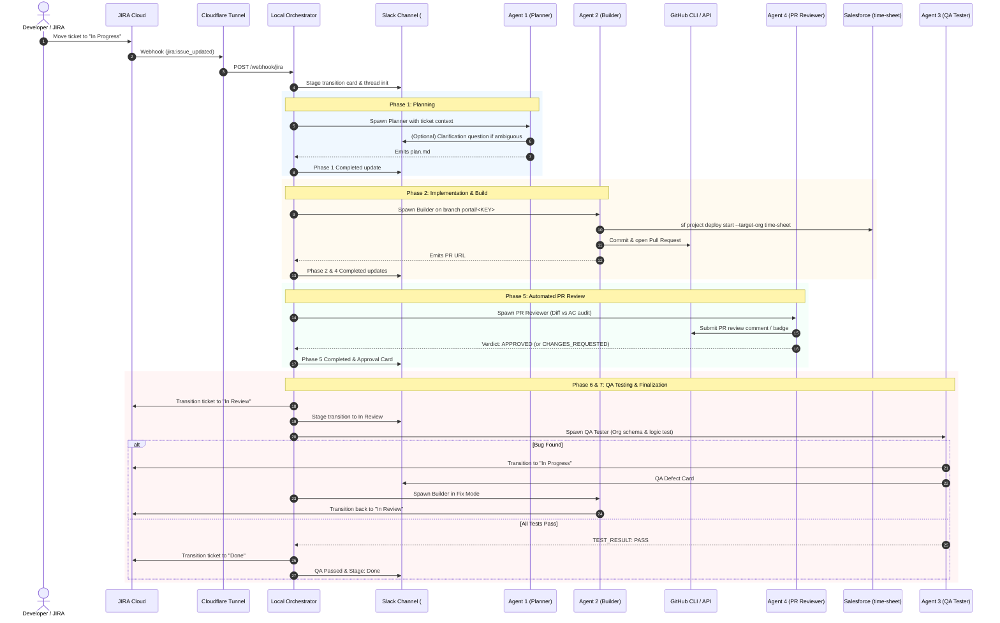

# POC Loop Engineering — Operational Workflow Guide

This guide details the operational mechanics, webhook flows, autonomous agent lifecycles, and verification loops implemented in **POC Loop Engineering**.

---

## 1. High-Level Delivery Lifecycle

The orchestration pipeline runs autonomously from the moment a JIRA ticket is marked `In Progress` until the resulting GitHub PR is merged and the ticket is moved to `Done`.



---

## 2. Webhook & Ingress Mechanics

### JIRA Webhook Configuration
- **Webhook URL**: `https://<tunnel-subdomain>.trycloudflare.com/webhook/jira`
- **Events**:
  - `Issue Updated`: Triggers delivery when an issue is moved to `In Progress` or when status transitions occur.
  - `Issue Created`: Monitors new issues added to active sprints.
- **Deduplication**: The orchestrator includes a 10-second debounce cache per ticket state to prevent duplicate notifications during rapid webhook firings.

### GitHub Webhook Configuration
- **Webhook URL**: `https://<tunnel-subdomain>.trycloudflare.com/webhook/github`
- **Events**: `pull_request` (`closed` / `merged`).
- **Automation**: When a PR associated with a ticket is merged into `main`, the orchestrator identifies the ticket key from the PR branch (`portal/<KEY>`) or title, marks the JIRA ticket as `Done`, and posts a confirmation update to Slack.

---

## 3. Human-In-The-Loop (HITL) Slack Clarification

If Agent 1 encounters an ambiguous requirement during planning:
1. Agent 1 pauses execution and outputs a structured question:
   ```
   NEEDS_INPUT: Should the picklist include standard values (A, B, C) or custom values?
   ```
2. The orchestrator intercepts this marker, posts the question directly into the ticket's Slack thread, and pauses execution.
3. A developer or product owner replies directly in the thread.
4. The Slack Socket Mode listener receives the reply and resumes Agent 1 with the user's answer, allowing planning to continue without restarting.

---

## 4. Multi-Agent Roles & Protocols

### Agent 1 — Planner
- **Inputs**: Ticket summary, description (ADF parsed), `PROJECT.md`, `INSTRUCTIONS.md`, and `MEMORY.md`.
- **Output**: `agent-context/tickets/<KEY>/plan.md`.
- **Responsibilities**: Validates existing metadata in Salesforce org, determines naming standards, defines acceptance criteria, and generates step-by-step instructions.

### Agent 2 — Builder
- **Inputs**: `plan.md`, `PROJECT.md`, and `INSTRUCTIONS.md`.
- **Output**: Salesforce metadata in `force-app/main/default/`, updated `MEMORY.md` and `CHANGELOG.md`.
- **Responsibilities**: Creates metadata XML files, deploys and verifies against `time-sheet` org via `sf project deploy start`, commits to `portal/<KEY>`, and opens GitHub PR via `gh pr create`.

### Agent 4 — PR Reviewer (Gatekeeper)
- **Inputs**: GitHub PR diff (`gh pr diff`), JIRA ticket acceptance criteria, and target org schema.
- **Output**: PR review verdict (`APPROVED` vs `NEEDS_CHANGES`), audit report in `agent-context/tickets/<KEY>/pr-review.md`.
- **Responsibilities**: Checks PascalCase conventions, restricted picklists, help texts, and org compilation. Intercepts GitHub GraphQL self-approval limitations and posts standard markdown review badges. Only approved PRs advance to QA.

### Agent 3 — QA Tester
- **Inputs**: Deployed org schema, `plan.md`, and `test-report.md`.
- **Output**: `agent-context/tickets/<KEY>/test-report.md`, pass/fail verdict.
- **Responsibilities**: Validates field definitions, picklists, and record-level automation against the `time-sheet` Salesforce org. If defects are found, transitions JIRA back to `In Progress` and activates the Builder fix loop until all tests pass.

---

## 5. Persistent Living Memory Architecture

```
agent-context/
├── PROJECT.md          # Architectural standards, target org details, and conventions
├── INSTRUCTIONS.md     # Standing operational guidelines for all agents
├── MEMORY.md           # Distilled, living inventory of deployed Salesforce components
├── CHANGELOG.md        # Append-only chronological ledger of completed tickets
└── tickets/
    ├── SCRUM-6/        # Ticket-specific plans and reports
    │   └── plan.md
    ├── SCRUM-8/
    │   └── plan.md
    └── SCRUM-10/
        ├── plan.md
        ├── pr-review.md
        └── test-report.md
```

---

## 6. GitHub Actions PR Review & Execution Switch

### 6.1 Offloading to GitHub Actions CI/CD
To reduce LLM token usage and avoid keeping the local orchestrator occupied during review loops, PR reviews can run natively in GitHub Actions via `.github/workflows/pr-review.yml`.
- **Trigger Events:**
  - Pull Request opened, synchronized, reopened, or ready for review.
  - Manual dispatch with optional `enable_agent` parameter.
- **Workflow Pipeline:**
  1. Checks out the branch and installs project dependencies.
  2. Evaluates the `ENABLE_PR_REVIEW_AGENT` switch.
  3. Executes `scripts/run-pr-review.js --pr <PR_NUMBER>`.
  4. Posts a GitHub PR review (Approval badge or Changes Requested).
  5. Emits real-time review verdict cards into Slack.
  6. Writes a GitHub Actions Step Summary for pull request reviewers.

### 6.2 Agent Switch (ON / OFF)
The PR Review Agent includes a configuration switch: `ENABLE_PR_REVIEW_AGENT` (default: `true`).

- **When ON (`ENABLE_PR_REVIEW_AGENT=true`):**
  - **Local Loop:** Phase 5 executes the full PR Review Agent workflow.
  - **GitHub Actions:** Runs the PR review job, posts approvals or change requests to GitHub, and notifies Slack.
- **When OFF (`ENABLE_PR_REVIEW_AGENT=false`):**
  - **Local Loop:** Phase 5 is bypassed cleanly. The orchestrator updates the Slack thread and immediately moves to Phase 6 (JIRA Finalization) and Phase 7 (QA Validation).
  - **GitHub Actions:** The workflow detects the switch, logs a skipped notice to the step summary, and terminates cleanly with exit code `0`.

---

## 7. Microsoft Teams Dual-Broadcast Observability

### 7.1 Lifecycle Event Dispatch
Whenever a stage or phase change occurs, the orchestrator triggers both Slack and Microsoft Teams in parallel:
- **Phase Started / Completed / Failed**: Dispatched via `notifyTeamsPhase(...)` in `src/teams.js`.
- **Ticket Stage Transitions**: Dispatched via `notifyTeamsStageChange(...)` (e.g. `To Do` ➔ `In Progress` ➔ `In Review` ➔ `Done`).

### 7.2 Channel Delivery Mechanics
- **Primary: Teams Channel Email via SMTP**: Rich HTML cards are transmitted to the channel email (`@in.teams.ms`) via Nodemailer SMTP. This method requires zero Azure App registrations or tenant-admin consent.
- **Secondary: Webhook / Adaptive Cards**: Formatted Adaptive Card 1.4 JSON payloads sent via HTTP POST to Power Automate webhook endpoints when configured.

### 7.3 Card Content Breakdown
Every Teams card features:
1. **Header Banner**: Color-coded to reflect phase/stage status.
2. **Key Metadata**: JIRA Ticket key, target Salesforce org (`time-sheet`), timestamp.
3. **Structured Context Summary**: Formatted bullet points for ticket scope, acceptance criteria, components modified, and coverage metrics.
4. **Action Buttons**: Direct deep links to the **[🎯 JIRA Ticket]** and **[🐙 GitHub PR]**.

